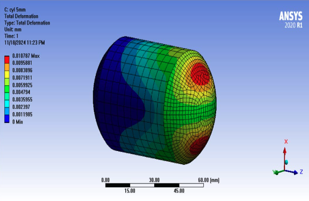

# Quantum Machine Learning for Simulations

## Motivation

### Composite Propulsion Tanks

*Ram K Aluru*

### NASA CFD 2030 vision

Source: [https://ntrs.nasa.gov/api/citations/20190025243/downloads/20190025243.pdf](https://ntrs.nasa.gov/api/citations/20190025243/downloads/20190025243.pdf)

## Problem

### Current Challenges for CFD Simulations

*   High Computational Cost for Turbulent Flows
*   Multi-Physics and Multi-Scale Simulations
*   Convergence Problems for Complex Geometries

Source: [https://doi.org/10.1016/j.est.2024.110475](https://doi.org/10.1016/j.est.2024.110475)

## Solution

### Physics Inspired Neural Networks (PINNs)

*Higher Accuracy & Multi-Physics Capability with Less Data*
source: [https://doi.org/10.1016/j.petrol.2022.110179](https://doi.org/10.1016/j.petrol.2022.110179)

### Quantum Physics-Informed Neural Networks

*   Architecture Variants
*   Quantum Advantage

Source: [https://www.mdpi.com/1099-4300/26/8/649](https://www.mdpi.com/1099-4300/26/8/649)

### Hybrid Quantum Physics Informed Neural Networks

*Variational Quantum Circuit (VQC) with focus on Geometry*
Source: [https://arxiv.org/html/2304.11247v3](https://arxiv.org/html/2304.11247v3)

## Market Opportunities

Year: 2025  
TAM: $3 Billion  
SAM: $700 million  
SOM: $30 million  
Market leaders: ANSYS, COMSOL, Siemens NX

## Business Model

### Competition

*   QML Quantum Node Layers
*   Classical PINN
*  Turbulent Flows
*	CRFP Vessels

### Overview
Quantum advantage to AI for simulations

## Outlook

*   Collaborations: Academic and Industries
*   Extensions: Simulation domains
*   Industries and SMEs
*   Funding programs

## Industry Applications

*   AEROSPACE & DEFENSE INDUSTRIES
*   AUTOMOTIVE INDUSTRY
*   CHEMICAL & INDUSTRIAL COMPANIES
*   HEALTHCARE INDUSTRY

### Quantum Physics-Informed Neural Networks

*Quantum AI for accelerating simulations*  
Source: [https://www.mdpi.com/1099-4300/26/8/649](https://www.mdpi.com/1099-4300/26/8/649)

## Business Model

*   Software Licensing
*   Customised Simulation Services
*   Data-as-a-Service
*   Training & Support

## Competition

*   **Traditional Simulation Tools:** ANSYS, COMSOL, Siemens NX, and other players in CFD.
*   **Emerging AI-Based Solutions:** Some startups exploring AI-driven simulations but lack integration of physics.
*   **Gaps in the Market:** No companies combine PINNs with a focus on CFRP fuel tanks in space industry

## Market Opportunities

*Market leaders:* ANSYS, COMSOL, Siemens NX

